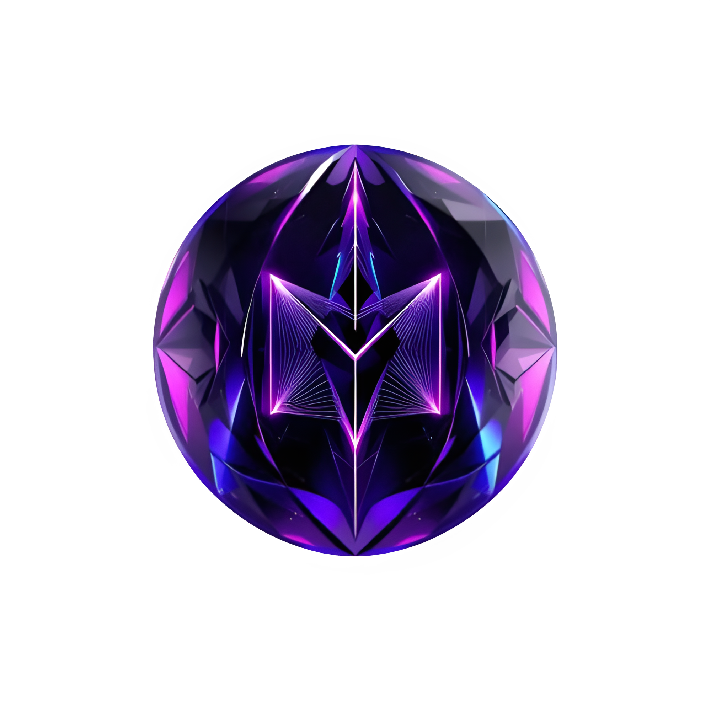

<div align="center">

  

  <h1>🌌 Beyond the Mirror: A Metaverse Tale</h1>
  <p><i>A futuristic, immersive fashion website exploring the digital couture experience in the Metaverse.</i></p>

  
</div>

---

## ✨ Overview

**"Beyond the Mirror"** is an award-inspired, scroll-animated, parallax, and interactive Metaverse fashion website. Built with advanced web technologies, it combines futuristic design, 3D animations, and immersive storytelling to transport users into a virtual realm of couture.

---

## 🚀 Features

- 🌠 **3D Image Carousel** with auto-scroll and hover interactivity  
- 🧬 **Metaverse-inspired UI** using Orbitron & futuristic fonts  
- 🌒 **Dark/Light Mode Toggle**  
- 🌀 **Scroll-triggered animations** (GSAP magic)  
- 🎮 **Game-like transition effects** and immersive loading screens  
- 📷 Dynamic content synced with imagery  
- 💳 **Donate Now / CTA Buttons** for engagement  

---

## 🛠️ Tech Stack

| Tech         | Description                          |
|--------------|--------------------------------------|
| React.js     | Component-based frontend framework   |
| Tailwind CSS | Utility-first CSS for styling        |
| GSAP         | Scroll animations and transitions    |
| Vite         | Lightning-fast development tool      |
| JSX          | Modern component architecture        |

---

## 📁 Folder Structure

MetaVerse-Fashion/
├── public/                  # Static assets (images, gifs, etc.)
├── src/                     # Main React components
│   ├── components/
│   ├── pages/
│   ├── App.jsx
│   └── main.jsx
├── index.html
├── tailwind.config.js
└── vite.config.js


---

## 🧠 Inspiration

Built as a virtual couture experience for the next generation of digital fashion brands. This concept draws from:
- **The Virtual Couture Continuum**
- **Metaverse UI/UX Design**
- **Awwwards-Winning Experiences**

---

## 🧑‍💻 How to Run

```bash
# Clone this repo
git clone https://github.com/yourusername/metaverse-fashion.git

# Navigate to the project folder
cd metaverse-fashion

# Install dependencies
npm install

# Run locally
npm run dev

🧪 <a name="snippets">Snippets</a>

Commonly used styles, animations, and reusable utility classes can be found in:

    index.css

    components/RoundedCorners.jsx

    components/Loader.jsx

    components/Hero.jsx

🧵 Contributors

👩‍💻 Muskan Tripathi — Developer & Creative Lead

